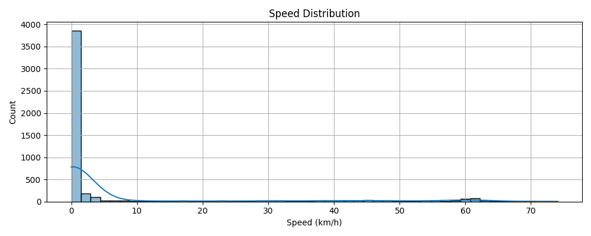
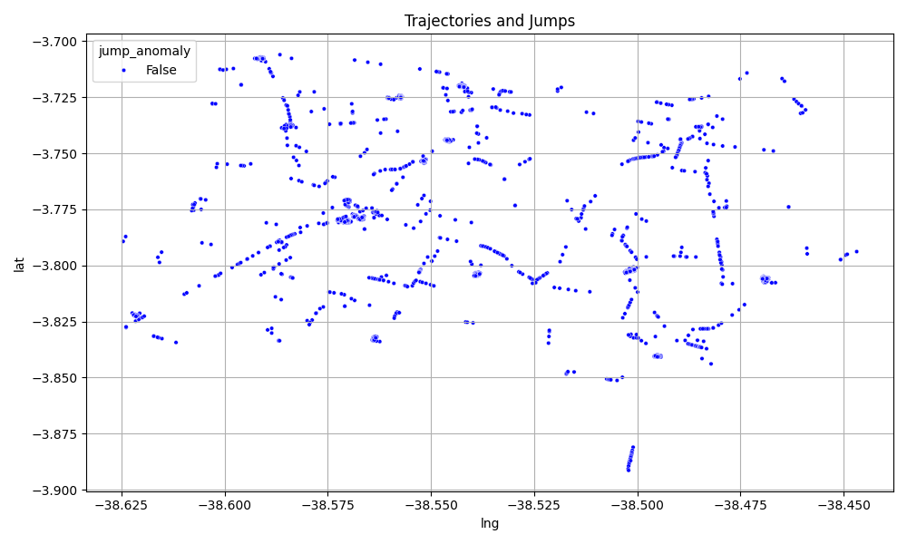
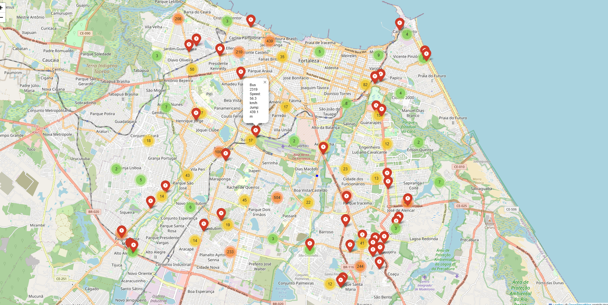

# anomob-detect

anomaly detection in mobility data

the analysis is based on the **bus mobility dataset (gps)** from **march 11, 2015**, available at:
https://dados.fortaleza.ce.gov.br/dataset/dados_mobilidade_onibus_2015_gps_paradas_validacao

these data were made publicly available by **etufor** in partnership with the **fortaleza city hall** through the official open data portal:
https://dados.fortaleza.ce.gov.br/


## 1. what can be an anomaly?

- very high or negative speed (e.g., > 120 km/h or < 0)
- zero speed for a long time while the bus is expected to be moving
- coordinates outside the expected area (e.g., outside the city's geographic boundary)
- sudden changes in direction or speed that don't make sense (e.g., 180º turn in 1 second)

## 2. steps

### step 1: load and clean the data

- read the csv file
- handle missing or invalid values

### step 2: basic analysis to find simple anomalies

- detect speeds outside the expected range
- detect coordinates outside the city's bounding box

### step 3: temporal and spatial analysis

- for each bus, check for sudden jumps in position between consecutive records (using euclidean or haversine distance)
- identify unusual speed patterns over time

### step 4: machine learning (optional for advanced stages)

- use anomaly detection models, such as:
  - isolation forest
  - dbscan (for clustering and outlier detection)
  - neural network autoencoders to detect unusual data patterns


## 3. how to run

1. make sure you have Python 3.8+ installed.
2. install the required dependencies:

   ```bash
   pip install -r requirements.txt
   ```

   or manually:
   ```bash
   pip install pandas numpy matplotlib seaborn geopy scikit-learn folium
   ```

3. Run the anomaly detection script:

   ```bash
   python src/detect_anomalies.py
   ```

4. The script will generate:
   - `anomalies_detected.csv`
   - an interactive map: `anomaly_map.html`

## 4. example outputs

### speed distribution


### trajectories and jumps


### interactive anomaly map

